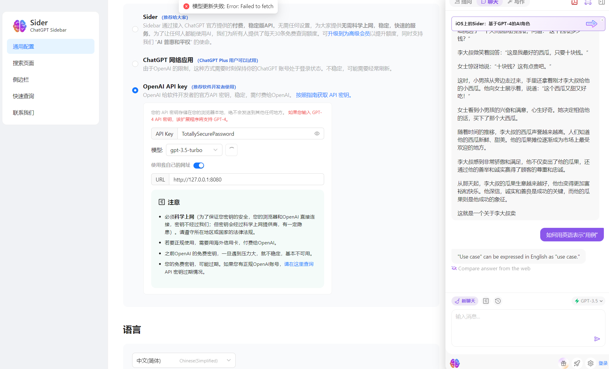

# 这是一个指导你如何在Sider程序中应用本程序的API
Sider ，一个浏览器插件

https://chrome.google.com/webstore/detail/difoiogjjojoaoomphldepapgpbgkhkb

---
# 设置

打开插件自己的设置页，大概是 chrome-extension://difoiogjjojoaoomphldepapgpbgkhkb/options.html?section=general

找到通用设置-如何访问 ChatGPT 并在任何地方使用它-OpenAI KEY 

在API KEY中填写你的API管理密码

模型默认即可，获取不到的（接口不一样）

URL写你的域名/IP+端口，比如 http://127.0.0.1:8080 ，原先完整URL后面的 /v1 什么的不需要填写

然后直接就能用了

示例图

# 不足

- Sider的策略是开启一个聊天，然后始终重复编辑这个对话，使用了本项目API后会导致一直会新建对话，不会删除或编辑旧的对话，所以你需要自行清理。